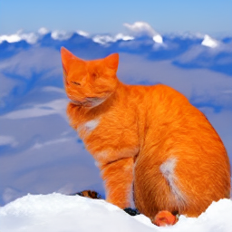

#  Diffusion Models Homework

In this assignment you will become familiar with the basic concepts of diffusion models. Although the models corresponding to the state of the art require a very high computational power, there are simple implementations that we will use to analyze the image generation.

## PART 1: Forward Process (1.5 points)

As seen in the class, the same amount of noise is not added at each step of the foward process. This amount of noise is regulated by a schedule wich scales the mean and the variance. This ensures that the variance doesn't explode as we add more noise.

Your task is to test new schedule functions in order to keep the distribution as structured as possible for as many steps as possible. For a function you should analyze and explain the reasons for the results obtained.

Run the Jupiter Notebook diffussion_model_demo.py on your computer. Experiment with varying the schedule with two functions of your choice as well as plotting the beta functions and discussing the differences between the given function and the two you created. In your report make evidence of the plots of both the distribution, an image of your choice of the database and the beta functions.

In the utils.py file you can find the function where you can add different schedules.

## PART 2: Reverse Process (1 point)

a. Look at the code in the ddpm.py file and based on the theory explain the training and sampling algorithms for the reverse diffusion process. (0.5 points) 
b. For the both training and smampling algorithms find the comments #Start and #End and describe in detail what is happening in each line. (0.5 points)

## PART 3: Classifier Free Guidance (2.5 points)

1. Train the ddpm.py model for the StanfordCars dataset and save the results. Choose a number of epochs between 50 and 100 and save the images. (0.5 points)

2. Check the comments #2.item on the code. (0.4 pints each item)

a. Include a label embedding for the classes by adding some modifications to the module architecture (UNet) in the file modules.py. (Hint: Do not implement the architecture from scratch, create a new class for the conditional UNet).

b. In the ddpm_conditional.py file pass the labels of the dataloader to the new model. Choose a rate to train unconditionally and modify the sampling algorithm in the Diffusion class to implement Classifier Free Guidance.

c. Train the ddpm_conditional.py model for the StanfordCars dataset and save the results.

d. Compare the best results of the conditional and the unconditional models and analize the results. For the analysis explain how the Classifier Free Guidance works (Check references [6]-[7]). If the results were not the expeceted explain why could have this happened.

e. Explain in your words what process should be the process to implement Classifier Guidance instead of Classifier Free Guidance.

## Bonus (1 point)
As a bonus we want you to experiment on a text to image task which uses Classifier Free Guidance, so vary the guidance_scale, the prompt, the batch size and the number of batches and analyze the results. 

https://colab.research.google.com/drive/1x4p2PokZ3XznBn35Q5BBD6K6Zs-tot5t?usp=sharing

Report the function of each of the parameters and upload a subplot with a text of your choice varying the parameters. 
To run the colab it is necessary to make a copy and run it for the first time with the baseline parameters.

## Report
All the results and analysis should be on a PDF file. Submit the eddited codes to the repository and the report before October 24th at 23:59.

## Requirements

* Python >= 3.7
* pytorch >= 1.6
* CUDA Toolkit
* GPU

## References 

[1] Sohl-Dickstein, J., Weiss, E. A., Maheswaranathan, N., & Ganguli, S. (2015). Deep unsupervised learning using nonequilibrium thermodynamics. arXiv preprint arXiv:1503.03585.  

[2] Max Welling & Yee Whye Teh. “Bayesian learning via stochastic gradient langevin dynamics.” ICML 2011. 

[3] Ho, J., Jain, A., & Abbeel, P. (2020). Denoising diffusion probabilistic models. arXiv preprint arXiv:2006.11239.

[4] Nichol, A., & Dhariwal, P. (2021). Improved Denoising Diffusion Probabilistic Models. https://doi.org/10.48550/arxiv.2102.09672

[5] Prafulla Dhariwal, Alex Nichol, Diffusion Models Beat GANs on Image Synthesis, arXiv: 2105.05233 

[6] Ho, J., & Salimans, T. (2022). Classifier-Free Diffusion Guidance. https://doi.org/10.48550/arxiv.2207.12598

[7] Nichol, A., Dhariwal, P., Ramesh, A., Shyam, P., Mishkin, P., McGrew, B., Sutskever, I., & Chen, M. (2021). GLIDE: Towards Photorealistic Image Generation and Editing with Text-Guided Diffusion Models. https://doi.org/10.48550/arxiv.2112.10741

